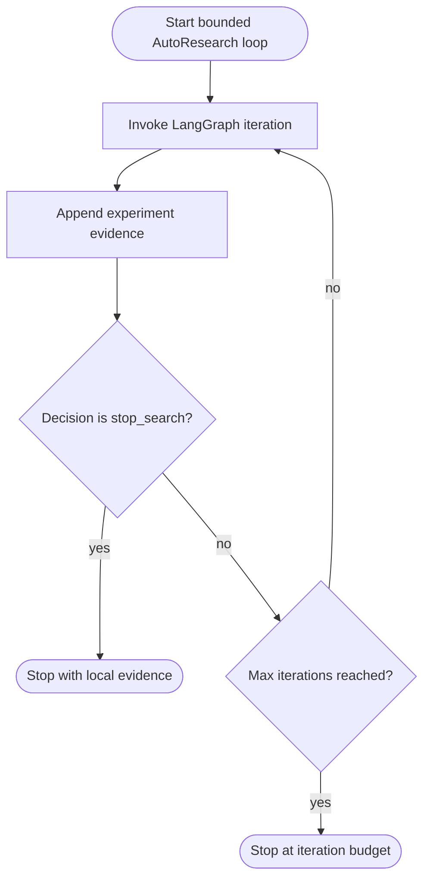
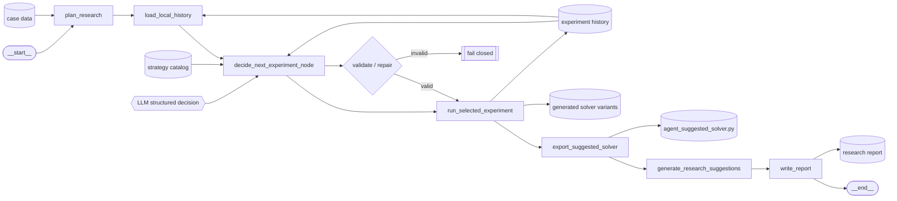

# Delivery AutoResearch Agent

An evidence-driven AutoResearch agent for delivery assignment optimization.

This repository is an open-source agent engineering case study: an
LLM-assisted research loop proposes local solver experiments, validates
structured decisions, executes strategy variants, compares evidence, and exports
a candidate solver while keeping the final solver independent from model APIs.

The project was implemented on top of the `langchain-ai/react-agent` starter
structure, then reshaped into a constrained LangGraph research workflow with a
standalone optimization-solver boundary.

## What This Shows

- A LangGraph workflow with explicit state, runtime context, and reproducible
  local artifacts.
- Structured LLM decisions over an executable strategy catalog instead of
  free-form code generation.
- Validation and one-pass repair before any model-selected experiment is run.
- Fail-closed guardrails: invalid LLM decisions are rejected rather than
  silently replaced by a hand-coded fallback.
- A typed local tool registry for data summaries, experiment history, strategy
  evaluation, solver export, report writing, and tool-calling demos.
- A strict boundary between agent-side research code and the standalone solver.
- A no-key replay fixture that demonstrates a real multi-iteration LLM-guided
  trajectory without calling an LLM or running experiments.

## Problem Setting

The case study is a delivery assignment task. Given candidate courier-task
pairs, the solver must return valid assignments while respecting constraints
such as courier uniqueness and candidate-pair validity.

The repository has two deliberately separate environments:

| Area | Path | Runtime | Responsibility |
| --- | --- | --- | --- |
| Agent side | `src/autoresearch_agent/` | Python 3.10+, LangGraph/LangChain, optional LLM APIs | Plan experiments, evaluate variants, maintain evidence, generate reports |
| Solver side | `solvers/solver.py` | Python 3.6-compatible, dependency-light, no network/model APIs | Define `solve(input_text)` for the solver runtime boundary |

The agent may research and generate candidates, but the solver remains a
standalone optimization program.

## Architecture

The agent has a bounded outer loop around one deterministic LangGraph
iteration:



One graph iteration runs:

1. `plan_research`: parse the case and summarize candidate data.
2. `load_local_history`: read append-only experiment evidence.
3. `decide_next_experiment_node`: ask the LLM for a structured research action
   and validate it against the strategy catalog.
4. `run_selected_experiment`: materialize and evaluate selected strategy
   variants.
5. `export_suggested_solver`: copy the best local candidate to the suggested
   solver path without replacing `solvers/solver.py`.
6. `generate_research_suggestions`: optionally ask for next-step reflections.
7. `write_report`: render a deterministic local research report.

`src/autoresearch_agent/research/loop_runner.py` wraps this graph in a bounded
outer loop, stopping when local evidence supports `stop_search` or when the
maximum iteration count is reached.



## Decision Model

The model does not write arbitrary solver code. It receives:

- a strategy catalog;
- primitive schema for inline strategy configs;
- data summary;
- local experiment history;
- evidence profile.

A valid decision must choose a known `search_space` or `stop_search`, exact
`config_ids` or valid inline `StrategyConfig` objects, a bounded
`candidate_limit`, and explanatory evidence fields. Invalid outputs are rejected
by `src/autoresearch_agent/research/llm_decision.py`; the graph performs one
repair attempt with allowed values and then fails closed if the repair is still
invalid.

## Replay Demo

The main no-key demo is a saved trajectory captured from a live multi-iteration
LLM run starting from the baseline solver:

```bash
make replay_demo
```

It replays `examples/sample_experiment_log.json` and shows:

- iteration 1 produced prior local history through a broad sweep;
- iteration 2 read that history and identified `scarce_courier_pressure`;
- the LLM selected `bundle_merge_duplicate` as the next targeted strategy;
- guardrail validation accepted the structured decision;
- local evaluation selected a candidate solver under the repository's proxy
  metric.

Replay mode is intentionally read-only: it does not call an LLM, run solver
experiments, write reports, or export solvers.

To refresh the fixture from your own configured LLM:

```bash
make capture_replay_fixture
```

## Tool-Calling Demo

The main graph uses constrained structured decisions for reproducibility. The
same local tool registry can also be exposed to a tool-calling model:

```bash
make tool_calling_demo
python scripts/run_tool_calling_demo.py --use-llm
```

The default command runs a deterministic no-key replay over safe read-only
tools. `--use-llm` asks the configured model to emit tool calls against the same
schemas before local execution.

## Repository Layout

```text
data/                         # sample delivery-assignment case data
examples/                     # sanitized replay fixture
scripts/                      # CLI entrypoints and fixture capture
solvers/                      # standalone solver boundary and local priors
src/autoresearch_agent/        # LangGraph agent, tools, replay, research logic
tests/                        # unit and solver-boundary tests
```

Generated reports, experiment logs, and solver variants are local artifacts.
They are created on demand under `reports/` and `experiments/` and are ignored
by git. The README is the intentionally consolidated public documentation entry
point.

## Quickstart

Install dependencies:

```bash
make install-dev
```

Run tests:

```bash
make test
```

Run lint and type checks:

```bash
make lint
```

Run a local strategy sweep without calling an LLM:

```bash
make strategy_sweep
```

Print the README Mermaid graph diagrams:

```bash
python scripts/render_agent_graph.py
```

Run the full AutoResearch loop with an LLM provider:

```bash
cp .env.example .env
# Fill DEEPSEEK_API_KEY or configure MODEL / MODEL_BASE_URL / MODEL_API_KEY_ENV.
python scripts/run_research_loop.py --max-iterations 5
```

Useful environment overrides:

```bash
AGENT_EXPERIMENTS_DIR=experiments/agent_runs/trial_001 \
AGENT_REPORT_PATH=reports/trial_001.md \
python scripts/run_research_loop.py --max-iterations 5
```

If you prefer `uv`, `uv sync --group dev` also works with the checked-in lock
file.

## Outputs And Evaluation

The agent writes local artifacts rather than relying on external benchmark
state:

- `experiments/**/runs.jsonl`: append-only experiment records.
- `experiments/**/runs.md`: optional human-readable experiment summaries.
- `reports/*.md`: deterministic research reports.
- `experiments/generated_variants/**`: materialized candidate solvers.
- `solvers/agent_suggested_solver.py`: exported best local candidate.
- `examples/sample_experiment_log.json`: sanitized no-key replay fixture.

`proxy_score` is a local comparison metric, not an external benchmark score.
Variants are ranked by ascending proxy score after validity, timeout, and risk
checks. The metric should be read as local evidence for agent behavior, not as a
claim about production or hidden benchmark performance.

## Configuration

The agent-side runtime is configured through `Context` and environment
variables:

```text
MODEL=deepseek/deepseek-chat
MODEL_BASE_URL=https://api.deepseek.com
MODEL_API_KEY_ENV=DEEPSEEK_API_KEY
ENABLE_LLM_DECISIONS=true
ENABLE_LLM_RECOMMENDATIONS=true
DATA_DIR=data
SOLVERS_DIR=solvers
EXPERIMENTS_DIR=experiments
SOLVER_ENTRYPOINT=solvers/prior_solver.py
REPORT_PATH=reports/autoresearch_report.md
CASE_TIMEOUT_SECONDS=10
```

The solver entrypoint must not read these variables or import agent-side
packages.

## License

MIT.
